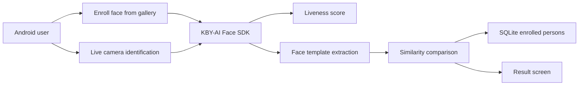

# FaceRecognition-Android

## Problem
This repository demonstrates mobile face recognition with passive liveness detection for Android. The use case is similar to attendance or identity verification workflows where a face must both match an enrolled user and pass an anti-spoofing check before being accepted.

## System Design

- Architecture:
  - enrollment and app entry flow in [`app/src/main/java/com/kbyai/facerecognition/MainActivity.kt`](C:\Users\91965\cars24\github-readme-batch\FaceRecognition-Android\app\src\main\java\com\kbyai\facerecognition\MainActivity.kt)
  - live recognition via CameraX / Fotoapparat in [`CameraActivity.java`](C:\Users\91965\cars24\github-readme-batch\FaceRecognition-Android\app\src\main\java\com\kbyai\facerecognition\CameraActivity.java) and [`CameraActivityKt.kt`](C:\Users\91965\cars24\github-readme-batch\FaceRecognition-Android\app\src\main\java\com\kbyai\facerecognition\CameraActivityKt.kt)
  - local person storage in [`DBManager.java`](C:\Users\91965\cars24\github-readme-batch\FaceRecognition-Android\app\src\main\java\com\kbyai\facerecognition\DBManager.java)
  - threshold configuration in [`SettingsActivity.kt`](C:\Users\91965\cars24\github-readme-batch\FaceRecognition-Android\app\src\main\java\com\kbyai\facerecognition\SettingsActivity.kt)
  - result presentation in [`ResultActivity.kt`](C:\Users\91965\cars24\github-readme-batch\FaceRecognition-Android\app\src\main\java\com\kbyai\facerecognition\ResultActivity.kt)
- Components:
  - SDK: KBY-AI mobile face recognition SDK in `libfacesdk`
  - DB: local SQLite database storing enrolled people, face crops, and templates
  - camera stack: CameraX and Fotoapparat
  - UI: Android activities and XML layouts
- This repo is a forked demo application, not an original end-to-end backend platform.

## Approach
- Why multi-agent?
  - Multi-agent is not used. This is a mobile biometric pipeline built around one on-device SDK.
- Why RAG?
  - RAG is not relevant because this app performs biometric detection and matching, not document retrieval.
- What the code actually does:
  - activates and initializes the KBY-AI face SDK
  - enrolls one face at a time from a selected image
  - stores extracted templates locally
  - runs live camera detection with liveness enabled
  - compares the live template with enrolled templates and opens a result screen for the best match

## Tech Stack
- Android
- Kotlin
- Java
- CameraX
- Fotoapparat
- SQLite
- KBY-AI Face SDK
- Gradle

## Demo
- Build and run the Android app
- Enroll a person from a gallery image
- Open the identification flow
- Let the camera capture a live face
- If liveness and similarity thresholds are passed, the app shows the identified person and confidence-related values

## Results
- The repo provides a working mobile demo for:
  - face enrollment
  - passive liveness checking
  - template-based matching
  - local result display
- In practical terms, it demonstrates the full user flow needed for an attendance-style biometric app.

## Learnings
- What worked:
  - the project cleanly separates enrollment, camera inference, settings, and results
  - local SQLite storage is enough for a self-contained demo
  - threshold controls make the SDK behavior tunable without code changes
- What did not:
  - this is a forked SDK demo, so much of the core biometric logic depends on external closed-source components rather than code in this repo
  - the activation key is hard-coded in [`MainActivity.kt`](C:\Users\91965\cars24\github-readme-batch\FaceRecognition-Android\app\src\main\java\com\kbyai\facerecognition\MainActivity.kt), which is risky for a public repository
  - the old README was mostly vendor documentation rather than project-specific explanation for your GitHub profile

## Supporting Docs
- [Architecture diagram](docs/architecture.png)
- [Evaluation logs and outputs](docs/evaluation.md)
- [Sample inputs and outputs](docs/sample_io.md)
- [Rich example assets](docs/examples/)
- [Representative outputs](docs/outputs/)
